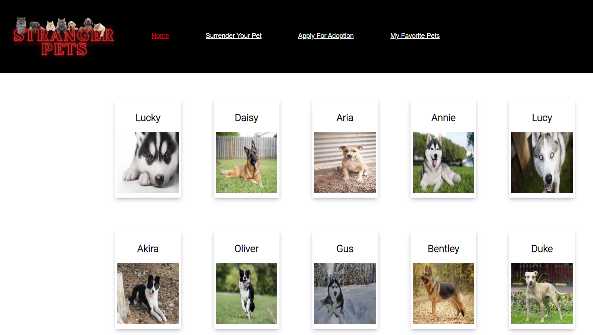

# Stranger Pets
The perfect place to find your pet!

# Table of Contents
<ul>
  <li>General Info</li>
  <li>Technologies</li>
  <li>Setup</li>
  <li>Features</li>
  <li>Improvments for future</li>
  <li>Contacts</li>
</ul>

# General Info
If there is one thing we all learned from covid is that having a pet is the best way to go. This website will help you find the prfect pet for you. 

# Technologies
<ul>
<li>React</li>
<li>HTML</li>
<li>CSS</li>
<li>Javascript</li>
<li>Material-UI</li>
<li>JSON</li>
</ul>

# Setup
To run this project: <ol>
  <li>Clone the repo to your computer</li>
  <li>In the terminal type npm install</li>
  <li>In the terminal type npm run server</li>
  <li>Open a different terminal and type npm start</li>
  </ol>

# Features
<ul>
  <li>View "available" pets for adoption (GET request)</li>
  <li>Favorite/unfavorite spesific pets and then view them on the "my favorite pets" route (PATCH)</li>
  <li>"Surrender" pets (add to the list - POST)</li>
  <li>User needs to fill-out an adoption form before the ability to "adopt" is given</li>
  <li>"Adopt" a pet (DELETE) </li>
</ul>

# Improvments for future
The general work was amazing and great. A few things we could've done better:
    <ul>
    <li>Naming of variables - a few times we got confused since out variable names were not accurate.</li>
    <li>Refactoring - Even though we used the components we made in different locations (as component should be used), we did repeat some of our code a few times.</li>
    <li>Cleaner Code - this connects to the first two. Having a cleaner code would've allowed us to work more efficently and encounter less problems.</li>
    </ul>

# Contacts
Created by  
<a href="https://www.linkedin.com/in/lucas-sweeney-b7840023b/" target="_blank">Lucas Sweeney</a> 
<a href="https://www.linkedin.com/in/anna-revall-clausen/" target="_blank">Anna Clausen</a> 
<a href="https://www.linkedin.com/in/lucas-sweeney-b7840023b/" target="_blank">Erik Quintana</a> 
<a href="https://www.linkedin.com/in/liordl/" target="_blank">Lior Levy</a> 

